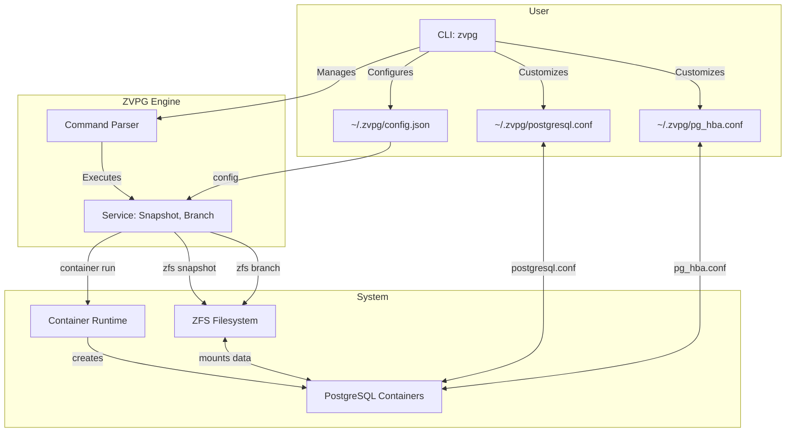
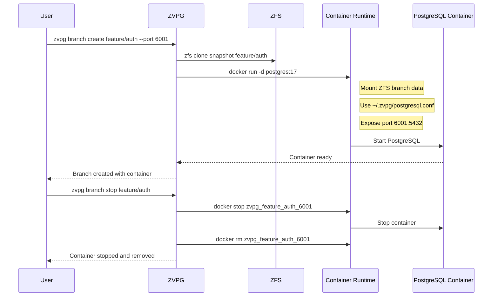

# ZVPG: ZFS Versioned PostgreSQL Engine
<div align="center">
  
  
  **Empowering PostgreSQL with Git-like branching and snapshotting capabilities, powered by the rock-solid ZFS file system.**
  
  [](https://github.com/Lemonhx/zvpg)
  [](./LICENSE)
  [](https://github.com/Lemonhx/zvpg/stargazers)
  [](https://github.com/Lemonhx/zvpg/network/members)
</div>

ZVPG (ZFS Versioned PostgreSQL Engine) revolutionizes database development and testing workflows. It leverages the native power of ZFS snapshots and branches to create instantaneous, space-efficient, and fully independent copies of your PostgreSQL databases. Think of it as `git` for your database, allowing you to create branches for features, test schemas, or run isolated experiments without impacting your primary instance or consuming significant disk space.

**New in v2.0:** ZVPG now uses a modern container-based architecture! Instead of managing PostgreSQL instances directly, ZVPG leverages container runtimes (Docker, Podman, or nerdctl) to provide better isolation, easier management, and more flexible configuration. Each branch runs in its own PostgreSQL container with custom configuration files stored in your `~/.zvpg/` directory.

## Key Features

-   **Instantaneous Snapshots:** Create atomic, read-only snapshots of your entire PostgreSQL data directory in milliseconds.
-   **Zero-Cost Branches:** Spin up multiple, fully-functional, writeable PostgreSQL instances from any snapshot, instantly. Branches are copy-on-write, meaning they only store the differences, saving immense disk space.
-   **Git-like Branching:** Manage different database states with a familiar branching model. Create a branch, make schema changes, test, and then merge or discard your work.
-   **Container-Based Isolation:** Every branch runs as an independent PostgreSQL container with its own port, ensuring complete isolation between development, testing, and production environments.
-   **Flexible Container Runtime:** Support for multiple container runtimes including Docker, Podman, and nerdctl.
-   **User-Managed Configuration:** PostgreSQL configuration files (postgresql.conf, pg_hba.conf) are stored in `~/.zvpg/` directory for easy customization.
-   **Comprehensive CLI:** A powerful and intuitive command-line interface with subcommands for all operations:
    - `zvpg init` - Environment initialization and health checking
    - `zvpg snapshot` / `zvpg commit` - Snapshot/commit management
    - `zvpg branch` - Git-like branch operations with PostgreSQL container management
    - `zvpg status` - System monitoring and health checks
-   **Flexible Configuration:** JSON-based configuration with sensible defaults and extensive customization options.

## Architecture

ZVPG acts as a control plane, orchestrating ZFS and containerized PostgreSQL instances to provide its versioning capabilities. The new container-based architecture provides better isolation and easier management:



1.  The user interacts with the `zvpg` **CLI**.
2.  The command is parsed and passed to the appropriate **Service** (e.g., `SnapshotService`, `BranchService`).
3.  The service layer executes low-level **ZFS commands** to create snapshots or branches of the main data volume.
4.  When a branch with PostgreSQL is started, the service uses the **container runtime** to start a new PostgreSQL container, mounting the branch data directory and using custom configuration from `~/.zvpg/`.
5.  Each PostgreSQL container runs on a unique port for complete isolation.

## Container Workflow

The container-based architecture provides several advantages:



## Getting Started

### Prerequisites

Before you begin, ensure you have the following dependencies installed and configured on your system:

-   **ZFS:** The ZFS filesystem must be installed and a storage pool created.
-   **Container Runtime:** One of the supported container runtimes (Docker, Podman, or nerdctl) must be installed and accessible.
-   **PostgreSQL Client Tools:** The PostgreSQL client tools (`psql`, `pg_isready`) must be in your `PATH` for health checks.
-   **Deno:** ZVPG is built on the Deno runtime.
## ZVPG Configuration Reference

This document describes all configuration options available in ZVPG v2.0.

### Configuration File Location

By default, ZVPG looks for configuration in `~/.zvpg/config.json`. You can override this with the `--config` flag:

```bash
zvpg --config /path/to/config.json branch create test
```

### Configuration Options

#### ZFS Settings

| Option         | Type   | Default           | Description                           |
| -------------- | ------ | ----------------- | ------------------------------------- |
| `zfsPool`      | string | `"zvpg_pool"`     | Name of the ZFS pool to use           |
| `mountDir`     | string | `"/var/lib/zvpg"` | Base mount directory for ZFS datasets |
| `dataSubdir`   | string | `"data"`          | Subdirectory for main data            |
| `clonesSubdir` | string | `"clones"`        | Subdirectory for clones               |
| `socketSubdir` | string | `"sockets"`       | Subdirectory for sockets              |

#### PostgreSQL Settings

| Option            | Type   | Default                        | Description                        |
| ----------------- | ------ | ------------------------------ | ---------------------------------- |
| `postgresUser`    | string | `"postgres"`                   | Default PostgreSQL user            |
| `postgresDb`      | string | `"postgres"`                   | Default PostgreSQL database        |

#### Container Settings

| Option             | Type   | Default                     | Description                                              |
| ------------------ | ------ | --------------------------- | -------------------------------------------------------- |
| `containerRuntime` | string | `"docker"`                  | Container runtime to use (`docker`, `podman`, `nerdctl`) |
| `pgBaseImage`      | string | `"postgres:17"`             | PostgreSQL container image                               |
| `pgConfigDir`      | string | `"~/.zvpg"`                 | Directory for PostgreSQL configuration files             |
| `pgHbaPath`        | string | `"~/.zvpg/pg_hba.conf"`     | Path to pg_hba.conf file                                 |
| `pgIdentPath`        | string | `"~/.zvpg/pg_ident.conf"`     | Path to pg_ident.conf file                                 |
| `pgConfPath`       | string | `"~/.zvpg/postgresql.conf"` | Path to postgresql.conf file                             |

#### Network Settings

| Option             | Type   | Default       | Description                             |
| ------------------ | ------ | ------------- | --------------------------------------- |
| `branchPortStart`   | number | `6001`        | Starting port for PostgreSQL containers |
| `branchPortEnd`     | number | `6099`        | Ending port for PostgreSQL containers   |


#### Branch Settings

| Option                | Type   | Default              | Description                    |
| --------------------- | ------ | -------------------- | ------------------------------ |
| `branchDefault`       | string | `"main"`             | Default branch name            |
| `branchNamingPattern` | string | `FOLLOWS GIT` | Regex pattern for branch names |

> git is using `^(?!\/|\.|.*([\/.]\.|\/\/|\.lock$))[\p{L}\p{N}\-_\/]+$` for parsing branch name


#### Logging Settings

| Option     | Type   | Default           | Description                                  |
| ---------- | ------ | ----------------- | -------------------------------------------- |
| `logLevel` | string | `"INFO"`          | Log level (`DEBUG`, `INFO`, `WARN`, `ERROR`) |
| `logDir`   | string | `"/var/log/zvpg"` | Directory for log files                      |

### Example Configurations

#### Docker with Custom Image

```json
{
  "containerRuntime": "docker",
  "pgBaseImage": "postgres:16-alpine",
  "pgConfigDir": "~/.zvpg",
  "branchPortStart": 7001,
  "branchPortEnd": 7099
}
```

#### Podman with Rootless Containers

```json
{
  "containerRuntime": "podman",
  "pgBaseImage": "docker.io/postgres:17",
  "pgConfigDir": "~/.config/zvpg",
}
```

#### nerdctl with Custom Pool

```json
{
  "containerRuntime": "nerdctl",
  "zfsPool": "nvme_pool",
  "pgBaseImage": "postgres:17",
  "mountDir": "/mnt/nvme/zvpg"
}
```

### PostgreSQL Configuration Files

#### postgresql.conf

Located at `~/.zvpg/postgresql.conf` by default. This file is mounted into each PostgreSQL container. Key settings:

- `listen_addresses = '*'` - Allow connections from all interfaces
- `port = 5432` - Internal container port (mapped to host port)
- `shared_buffers` - Memory allocation for PostgreSQL
- `log_*` - Logging configuration

#### pg_hba.conf

Located at `~/.zvpg/pg_hba.conf` by default. Controls client authentication:

- `local all all trust` - Trust local connections
- `host all all 127.0.0.1/32 trust` - Trust localhost connections
- `host all all 0.0.0.0/0 md5` - Require password for remote connections

### Environment Variables

ZVPG respects the following environment variables:

- `ZVPG_CONFIG_DIR` - Override config directory (default: `~/.zvpg`)
- `ZVPG_LOG_LEVEL` - Override log level
- `ZVPG_CONTAINER_RUNTIME` - Override container runtime

### Security Considerations

1. **Network Security**: Configure `pg_hba.conf` appropriately for your network
2. **Container Security**: Use specific image tags instead of `latest`
3. **File Permissions**: Ensure config files have appropriate permissions
4. **Firewall**: Configure firewall rules for the port range
5. **Container Images**: Use trusted PostgreSQL images
6. **Secrets**: Avoid storing passwords in configuration files

### Performance Tuning

#### ZFS Tuning

- Use `compression=lz4` for better performance
- Set `atime=off` to reduce I/O
- Use dedicated storage for ZFS pools

#### Container Tuning

- Set appropriate `shared_buffers` in postgresql.conf
- Use local storage for container runtime
- Limit container memory usage if needed

#### Network Tuning

- Use smaller port ranges for fewer containers
- Configure appropriate timeouts
- Use localhost connections when possible


#### PostgreSQL Configuration Templates

ZVPG includes template configuration files that you can customize:

**Edit the configuration files to match your requirements:**
- `~/.zvpg/postgresql.conf`: Main PostgreSQL configuration
- `~/.zvpg/pg_hba.conf`: Client authentication configuration
- `~/.zvpg/config.json`: ZVPG system configuration


## Usage

ZVPG provides a simple yet powerful set of commands to manage your database versions.

### Snapshots

`zvpg commit` is an alias of `zvpg snapshot`

Snapshots are the foundation of ZVPG. They are immutable, point-in-time images of your database.

-   **Create a snapshot:**
    ```bash
    zvpg snapshot create my_first_snapshot -m "Initial database schema"
    ```

-   **List all snapshots:**
    ```bash
    zvpg snapshot list
    ```

-   **Get snapshot information:**
    ```bash
    zvpg snapshot info my_first_snapshot
    ```

-   **Delete a snapshot:**
    ```bash
    zvpg snapshot delete my_first_snapshot
    ```

### Commits

Commits are an alias for snapshots, providing a Git-like interface.

-   **Create a commit:**
    ```bash
    zvpg commit create my_commit -m "Add user authentication"
    ```

-   **List all commits:**
    ```bash
    zvpg commit list
    ```

-   **Show commit information:**
    ```bash
    zvpg commit show my_commit
    ```

-   **Remove a commit:**
    ```bash
    zvpg commit remove my_commit
    ```

### Branches

Branches provide a comprehensive abstraction for managing development workflows, similar to Git. They use the dedicated ZFS-based branch system and can optionally run PostgreSQL instances.

-   **Create a branch from current state (latest snapshot):**
    ```bash
    zvpg branch create feature/new-api
    ```

-   **Create a branch from a specific snapshot:**
    ```bash
    zvpg branch create feature/new-api --from my_snapshot
    ```

-   **Create a branch with a specific parent:**
    ```bash
    zvpg branch create feature/new-api --parent development
    ```

-   **Create a branch with specific PostgreSQL port:**
    ```bash
    zvpg branch create feature/new-api --port 6433
    ```

-   **Start PostgreSQL container for an existing branch:**
    ```bash
    zvpg branch start feature/new-api --port 6433
    ```

-   **Stop PostgreSQL container for a branch:**
    ```bash
    zvpg branch stop feature/new-api
    ```

-   **List branches:**
    ```bash
    zvpg branch list
    ```

-   **Get branch information:**
    ```bash
    zvpg branch info feature/new-api
    ```

-   **Connect to a branch's PostgreSQL container:**
    ```bash
    psql -h localhost -p 6433 -U postgres postgres
    ```

-   **Create a snapshot from a branch:**
    ```bash
    zvpg branch snapshot feature/new-api milestone-1 -m "First milestone completed"
    ```

-   **Delete a branch:**
    ```bash
    zvpg branch delete feature/new-api
    ```

### Status

Get a comprehensive overview of the entire system.

-   **Show complete system status:**
    ```bash
    zvpg status system
    ```

-   **Show detailed branches status:**
    ```bash
    zvpg status branches
    ```

-   **Show detailed snapshots status:**
    ```bash
    zvpg status snapshots
    ```

-   **Perform system health check:**
    ```bash
    zvpg status health
    ```

## Configuration

ZVPG is configured via a JSON file (usually located at `~/.zvpg/config.json`). The `init` command will generate a default configuration file.

Key configuration options include:

-   `zfsPool`: The name of the ZFS pool to use.
-   `mountDir`: The base directory where ZFS datasets are mounted.
-   `branchPortStart` / `branchPortEnd`: The range of network ports to use for branch PostgreSQL instances.
-   `logLevel`: The logging verbosity.

## Command Reference

### Initialize Commands
```bash
zvpg init env [options]              # Initialize the ZVPG environment
zvpg init check [options]            # Check environment initialization status
```

### Snapshot Commands
```bash
zvpg snapshot create <name> [options]    # Create a new snapshot
zvpg snapshot list [options]             # List all snapshots
zvpg snapshot info <name> [options]      # Show snapshot information
zvpg snapshot delete <name> [options]    # Delete a snapshot
```

### Commit Commands (Snapshot Aliases)
```bash
zvpg commit create <name> [options]      # Create a new commit
zvpg commit list [options]               # List all commits
zvpg commit show <name> [options]        # Show commit information
zvpg commit remove <name> [options]      # Remove a commit
```

### Branch Commands
```bash
zvpg branch create <name> [options]               # Create a new branch (PostgreSQL auto-started)
zvpg branch list [options]                        # List all branches
zvpg branch info <name> [options]                 # Show branch information
zvpg branch delete <name> [options]               # Delete a branch
zvpg branch start <name> [options]                # Start PostgreSQL instance for branch
zvpg branch stop <name> [options]                 # Stop PostgreSQL instance for branch
zvpg branch snapshot <branch> <snapshot> [options] # Create snapshot from branch
```

### Status Commands
```bash
zvpg status system [options]             # Show complete system status
zvpg status branches [options]           # Show detailed branches status
zvpg status snapshots [options]          # Show detailed snapshots status
zvpg status health [options]             # Perform system health check
```

### Common Options
- `-c, --config <config>`: Configuration file path
- `-f, --format <format>`: Output format (table|json) for list commands
- `-m, --message <message>`: Message for snapshot/commit creation
- `-p, --port <port>`: Port number for PostgreSQL instances
- `--from <snapshot>`: Create branch from specific snapshot
- `--parent <parent>`: Parent branch name (default: main)
- `--force`: Force operations (where applicable)

## Workflow Examples

### Basic Development Workflow

1. **Initialize the environment:**
   ```bash
   zvpg init env
   ```

2. **Create a snapshot of your current database:**
   ```bash
   zvpg snapshot create baseline -m "Initial production state"
   ```

3. **Create a development branch with PostgreSQL instance:**
   ```bash
   zvpg branch create feature/user-auth --from baseline
   ```

4. **Work on your branch (PostgreSQL automatically started):**
   ```bash
   # Connect to the branch's PostgreSQL instance (port shown in creation output)
   zvpg branch info feature/user-auth  # Check the port
   psql -p <port> -U postgres -h localhost
   ```

5. **Create a snapshot from your branch:**
   ```bash
   zvpg branch snapshot feature/user-auth milestone-1 -m "User authentication milestone"
   ```

6. **Stop the PostgreSQL instance when done:**
   ```bash
   zvpg branch stop feature/user-auth
   ```

7. **Clean up when no longer needed:**
   ```bash
   zvpg branch delete feature/user-auth
   ```

### Testing Workflow

1. **Create a testing branch:**
   ```bash
   zvpg branch create testing --from baseline
   ```

2. **Run your tests against the branch:**
   ```bash
   # Get the automatically assigned port
   PORT=$(zvpg branch info testing | grep "PostgreSQL Port" | awk '{print $3}')
   # Your tests connect to the assigned port
   npm test -- --db-port=$PORT
   ```

3. **Reset the test environment:**
   ```bash
   zvpg branch stop testing
   zvpg branch delete testing
   zvpg branch create testing --from baseline
   ```

### Monitoring and Maintenance

1. **Check system status:**
   ```bash
   zvpg status system
   ```

2. **Monitor branches:**
   ```bash
   zvpg branch list
   ```

3. **Check branch details:**
   ```bash
   zvpg branch info my-branch
   ```

4. **Check snapshots usage:**
   ```bash
   zvpg status snapshots
   ```

5. **Perform health check:**
   ```bash
   zvpg status health
   ```

## Troubleshooting

### Container Runtime Issues

1. **Container runtime not found:**
   ```bash
   # Check if your container runtime is installed
   docker --version
   podman --version
   nerdctl --version
   
   # Update configuration to use available runtime
   vim ~/.zvpg/config.json
   ```

2. **Port conflicts:**
   ```bash
   # Check which ports are in use
   zvpg status
   
   # Stop conflicting containers
   docker ps
   docker stop <container_name>
   ```

3. **Permission issues:**
   ```bash
   # Ensure user can access container runtime
   sudo usermod -aG docker $USER
   newgrp docker
   
   # For podman (rootless)
   systemctl --user enable podman.socket
   ```

### PostgreSQL Container Issues

1. **Container fails to start:**
   ```bash
   # Check container logs
   docker logs zvpg_<branch>_<port>
   
   # Check if data directory is properly mounted
   zvpg branch info <branch>
   ```

2. **Cannot connect to PostgreSQL:**
   ```bash
   # Check if container is running
   docker ps | grep zvpg
   
   # Test connection
   pg_isready -h localhost -p <port>
   
   # Check firewall/network settings
   telnet localhost <port>
   ```

3. **Configuration issues:**
   ```bash
   # Check configuration files
   cat ~/.zvpg/postgresql.conf
   cat ~/.zvpg/pg_hba.conf
   
   # Reset to defaults
   rm ~/.zvpg/postgresql.conf ~/.zvpg/pg_hba.conf
   zvpg branch stop <branch>
   zvpg branch start <branch>
   ```

### ZFS Issues

1. **ZFS dataset not found:**
   ```bash
   # Check if ZFS pool exists
   zfs list
   
   # Recreate environment
   zvpg init env
   ```

2. **Snapshot cleanup:**
   ```bash
   # List all snapshots
   zvpg snapshot list
   
   # Clean up old snapshots
   zvpg snapshot delete <snapshot_name>
   ```

## Contributing

We welcome contributions from the community! Whether it's a bug report, a new feature, or a documentation improvement, please feel free to open an issue or submit a pull request.

Please read our [CONTRIBUTING.md](CONTRIBUTING.md) for detailed guidelines.

## License

ZVPG is licensed under the [Apache License 2.0](./LICENSE).