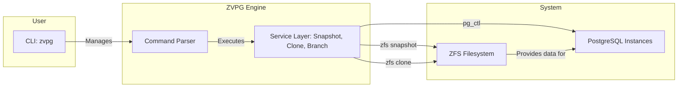

# ZVPG: ZFS Versioned PostgreSQL Engine
<div align="center">
  
  
  **Empowering PostgreSQL with Git-like branching and snapshotting capabilities, powered by the rock-solid ZFS file system.**
  
  [](https://github.com/Lemonhx/zvpg)
  [](./LICENSE)
  [](https://github.com/Lemonhx/zvpg/stargazers)
  [](https://github.com/Lemonhx/zvpg/network/members)
</div>

ZVPG (ZFS Versioned PostgreSQL Engine) revolutionizes database development and testing workflows. It leverages the native power of ZFS snapshots and clones to create instantaneous, space-efficient, and fully independent copies of your PostgreSQL databases. Think of it as `git` for your database, allowing you to create branches for features, test schemas, or run isolated experiments without impacting your primary instance or consuming significant disk space.

## Key Features

-   **Instantaneous Snapshots:** Create atomic, read-only snapshots of your entire PostgreSQL data directory in milliseconds.
-   **Zero-Cost Clones:** Spin up multiple, fully-functional, writeable PostgreSQL instances from any snapshot, instantly. Clones are copy-on-write, meaning they only store the differences, saving immense disk space.
-   **Git-like Branching:** Manage different database states with a familiar branching model. Create a branch, make schema changes, test, and then merge or discard your work.
-   **Complete Isolation:** Every clone runs as an independent PostgreSQL instance on its own port, ensuring no interference between development, testing, and production environments.
-   **Command-Line Interface:** A powerful and intuitive CLI (`zvpg`) to manage all your snapshots, clones, and branches.
-   **Simple Configuration:** A single JSON file to configure all aspects of the engine.

## Architecture

ZVPG acts as a control plane, orchestrating ZFS and PostgreSQL to provide its versioning capabilities. The core interaction can be visualized as follows:



1.  The user interacts with the `zvpg` **CLI**.
2.  The command is parsed and passed to the appropriate **Service** (e.g., `SnapshotService`).
3.  The service layer executes low-level **ZFS commands** to create snapshots or clones of the main data volume.
4.  When a clone is started, the service uses **`pg_ctl`** to start a new, independent PostgreSQL instance using the cloned data directory, assigning it a unique port.

## Getting Started

### Prerequisites

Before you begin, ensure you have the following dependencies installed and configured on your system:

-   **ZFS:** The ZFS filesystem must be installed and a storage pool created.
-   **PostgreSQL:** The standard PostgreSQL server binaries (`psql`, `pg_ctl`, `initdb`, etc.) must be in your `PATH`.
-   **Deno:** ZVPG is built on the Deno runtime.


### Initialization

Once installed, you need to initialize ZVPG. This command will set up the necessary ZFS datasets for storing the main PostgreSQL data, snapshots, and clones.

```bash
# This will create a ZFS pool named 'zvpg_pool' and set up its mount directory
sudo zvpg init --zfs-pool <your_zfs_pool_name> --mount-dir /var/lib/zvpg
```

## Usage

ZVPG provides a simple yet powerful set of commands to manage your database versions.

### Snapshots (Commit)

`zvpg commit` is an alias of `zvpg snapshot`

Snapshots are the foundation of ZVPG. They are immutable, point-in-time images of your database.


-   **Create a snapshot:**
    ```bash
    zvpg snapshot create my_first_snapshot -m "Initial database schema"
    ```

-   **List all snapshots:**
    ```bash
    zvpg snapshot list
    ```

-   **Delete a snapshot:**
    ```bash
    zvpg snapshot delete my_first_snapshot
    ```

### Clones

Clones are writeable copies of snapshots. This is where you do your work.

-   **Create a clone from a snapshot:**
    ```bash
    # ZVPG will automatically assign the next available port
    zvpg clone create my_first_snapshot --name "feature_x_testing"
    ```

-   **List all active clones:**
    ```bash
    zvpg clone list
    ```

-   **Start/Stop a clone's PostgreSQL instance:**
    ```bash
    zvpg clone start --port 6001
    zvpg clone stop --port 6001
    ```

-   **Connect to a clone:**
    ```bash
    psql -p 6001 -U <your_user> <your_db>
    ```

-   **Delete a clone:**
    ```bash
    zvpg clone delete --port 6001
    ```

### Branches

Branches provide a higher-level abstraction for managing development workflows, similar to Git.

-   **Create a branch:**
    ```bash
    zvpg branch create feature/new-api --parent main
    ```

-   **List branches:**
    ```bash
    zvpg branch list
    ```

-   **Create a snapshot on a branch:**
    ```bash
    zvpg branch snapshot feature/new-api migration_v2 -m "Add user table"
    ```

### Status

Get a comprehensive overview of the entire system.

```bash
zvpg status
```

## Configuration

ZVPG is configured via a JSON file (usually located at `~/.zvpg/config.json`). The `init` command will generate a default configuration file.

Key configuration options include:

-   `zfsPool`: The name of the ZFS pool to use.
-   `mountDir`: The base directory where ZFS datasets are mounted.
-   `clonePortStart` / `clonePortEnd`: The range of network ports to use for clones.
-   `logLevel`: The logging verbosity.

## Contributing

We welcome contributions from the community! Whether it's a bug report, a new feature, or a documentation improvement, please feel free to open an issue or submit a pull request.

Please read our [CONTRIBUTING.md](CONTRIBUTING.md) for detailed guidelines.

## License

ZVPG is licensed under the [Apache License 2.0](./LICENSE).