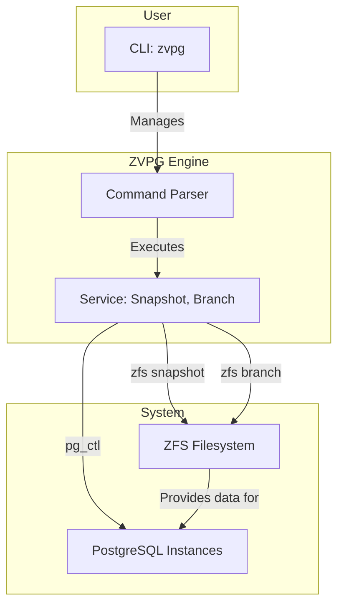

# ZVPG: ZFS Versioned PostgreSQL Engine
<div align="center">
  
  
  **Empowering PostgreSQL with Git-like branching and snapshotting capabilities, powered by the rock-solid ZFS file system.**
  
  [](https://github.com/Lemonhx/zvpg)
  [](./LICENSE)
  [](https://github.com/Lemonhx/zvpg/stargazers)
  [](https://github.com/Lemonhx/zvpg/network/members)
</div>

ZVPG (ZFS Versioned PostgreSQL Engine) revolutionizes database development and testing workflows. It leverages the native power of ZFS snapshots and branches to create instantaneous, space-efficient, and fully independent copies of your PostgreSQL databases. Think of it as `git` for your database, allowing you to create branches for features, test schemas, or run isolated experiments without impacting your primary instance or consuming significant disk space.

## Key Features

-   **Instantaneous Snapshots:** Create atomic, read-only snapshots of your entire PostgreSQL data directory in milliseconds.
-   **Zero-Cost Branches:** Spin up multiple, fully-functional, writeable PostgreSQL instances from any snapshot, instantly. Branches are copy-on-write, meaning they only store the differences, saving immense disk space.
-   **Git-like Branching:** Manage different database states with a familiar branching model. Create a branch, make schema changes, test, and then merge or discard your work.
-   **Complete Isolation:** Every branch can run as an independent PostgreSQL instance on its own port, ensuring no interference between development, testing, and production environments.
-   **Comprehensive CLI:** A powerful and intuitive command-line interface with subcommands for all operations:
    - `zvpg init` - Environment initialization and health checking
    - `zvpg snapshot` / `zvpg commit` - Snapshot/commit management
    - `zvpg branch` - Git-like branch operations with PostgreSQL instance management
    - `zvpg status` - System monitoring and health checks
-   **Flexible Configuration:** JSON-based configuration with sensible defaults and extensive customization options.

## Architecture

ZVPG acts as a control plane, orchestrating ZFS and PostgreSQL to provide its versioning capabilities. The core interaction can be visualized as follows:



1.  The user interacts with the `zvpg` **CLI**.
2.  The command is parsed and passed to the appropriate **Service** (e.g., `SnapshotService`, `BranchService`).
3.  The service layer executes low-level **ZFS commands** to create snapshots or branches of the main data volume.
4.  When a branch with PostgreSQL is started, the service uses **`pg_ctl`** to start a new, independent PostgreSQL instance using the branch data directory, assigning it a unique port.

## Getting Started

### Prerequisites

Before you begin, ensure you have the following dependencies installed and configured on your system:

-   **ZFS:** The ZFS filesystem must be installed and a storage pool created.
-   **PostgreSQL:** The standard PostgreSQL server binaries (`psql`, `pg_ctl`, `initdb`, etc.) must be in your `PATH`.
-   **Deno:** ZVPG is built on the Deno runtime.


### Initialization

Once installed, you need to initialize ZVPG. This command will set up the necessary ZFS datasets for storing the main PostgreSQL data, snapshots, and branches.

```bash
# Initialize the ZVPG environment
zvpg init env

# Check if the environment is properly initialized
zvpg init check
```

## Usage

ZVPG provides a simple yet powerful set of commands to manage your database versions.

### Snapshots

`zvpg commit` is an alias of `zvpg snapshot`

Snapshots are the foundation of ZVPG. They are immutable, point-in-time images of your database.

-   **Create a snapshot:**
    ```bash
    zvpg snapshot create my_first_snapshot -m "Initial database schema"
    ```

-   **List all snapshots:**
    ```bash
    zvpg snapshot list
    ```

-   **Get snapshot information:**
    ```bash
    zvpg snapshot info my_first_snapshot
    ```

-   **Delete a snapshot:**
    ```bash
    zvpg snapshot delete my_first_snapshot
    ```

### Commits

Commits are an alias for snapshots, providing a Git-like interface.

-   **Create a commit:**
    ```bash
    zvpg commit create my_commit -m "Add user authentication"
    ```

-   **List all commits:**
    ```bash
    zvpg commit list
    ```

-   **Show commit information:**
    ```bash
    zvpg commit show my_commit
    ```

-   **Remove a commit:**
    ```bash
    zvpg commit remove my_commit
    ```

### Branches

Branches provide a comprehensive abstraction for managing development workflows, similar to Git. They use the dedicated ZFS-based branch system and can optionally run PostgreSQL instances.

-   **Create a branch from current state (latest snapshot):**
    ```bash
    zvpg branch create feature/new-api
    ```

-   **Create a branch from a specific snapshot:**
    ```bash
    zvpg branch create feature/new-api --from my_snapshot
    ```

-   **Create a branch with a specific parent:**
    ```bash
    zvpg branch create feature/new-api --parent development
    ```

-   **Create a branch with specific PostgreSQL port:**
    ```bash
    zvpg branch create feature/new-api --port 5433
    ```

-   **Start PostgreSQL instance for an existing branch:**
    ```bash
    zvpg branch start feature/new-api --port 5433
    ```

-   **Stop PostgreSQL instance for a branch:**
    ```bash
    zvpg branch stop feature/new-api
    ```

-   **List branches:**
    ```bash
    zvpg branch list
    ```

-   **Get branch information:**
    ```bash
    zvpg branch info feature/new-api
    ```

-   **Connect to a branch's PostgreSQL instance:**
    ```bash
    psql -p 5433 -U <your_user> <your_db>
    ```

-   **Create a snapshot from a branch:**
    ```bash
    zvpg branch snapshot feature/new-api milestone-1 -m "First milestone completed"
    ```

-   **Delete a branch:**
    ```bash
    zvpg branch delete feature/new-api
    ```

### Status

Get a comprehensive overview of the entire system.

-   **Show complete system status:**
    ```bash
    zvpg status system
    ```

-   **Show detailed branches status:**
    ```bash
    zvpg status branches
    ```

-   **Show detailed snapshots status:**
    ```bash
    zvpg status snapshots
    ```

-   **Perform system health check:**
    ```bash
    zvpg status health
    ```

## Configuration

ZVPG is configured via a JSON file (usually located at `~/.zvpg/config.json`). The `init` command will generate a default configuration file.

Key configuration options include:

-   `zfsPool`: The name of the ZFS pool to use.
-   `mountDir`: The base directory where ZFS datasets are mounted.
-   `clonePortStart` / `clonePortEnd`: The range of network ports to use for branch PostgreSQL instances.
-   `logLevel`: The logging verbosity.

## Command Reference

### Initialize Commands
```bash
zvpg init env [options]              # Initialize the ZVPG environment
zvpg init check [options]            # Check environment initialization status
```

### Snapshot Commands
```bash
zvpg snapshot create <name> [options]    # Create a new snapshot
zvpg snapshot list [options]             # List all snapshots
zvpg snapshot info <name> [options]      # Show snapshot information
zvpg snapshot delete <name> [options]    # Delete a snapshot
```

### Commit Commands (Snapshot Aliases)
```bash
zvpg commit create <name> [options]      # Create a new commit
zvpg commit list [options]               # List all commits
zvpg commit show <name> [options]        # Show commit information
zvpg commit remove <name> [options]      # Remove a commit
```

### Branch Commands
```bash
zvpg branch create <name> [options]               # Create a new branch (PostgreSQL auto-started)
zvpg branch list [options]                        # List all branches
zvpg branch info <name> [options]                 # Show branch information
zvpg branch delete <name> [options]               # Delete a branch
zvpg branch start <name> [options]                # Start PostgreSQL instance for branch
zvpg branch stop <name> [options]                 # Stop PostgreSQL instance for branch
zvpg branch snapshot <branch> <snapshot> [options] # Create snapshot from branch
```

### Status Commands
```bash
zvpg status system [options]             # Show complete system status
zvpg status branches [options]           # Show detailed branches status
zvpg status snapshots [options]          # Show detailed snapshots status
zvpg status health [options]             # Perform system health check
```

### Common Options
- `-c, --config <config>`: Configuration file path
- `-f, --format <format>`: Output format (table|json) for list commands
- `-m, --message <message>`: Message for snapshot/commit creation
- `-p, --port <port>`: Port number for PostgreSQL instances
- `--from <snapshot>`: Create branch from specific snapshot
- `--parent <parent>`: Parent branch name (default: main)
- `--force`: Force operations (where applicable)

## Workflow Examples

### Basic Development Workflow

1. **Initialize the environment:**
   ```bash
   zvpg init env
   ```

2. **Create a snapshot of your current database:**
   ```bash
   zvpg snapshot create baseline -m "Initial production state"
   ```

3. **Create a development branch with PostgreSQL instance:**
   ```bash
   zvpg branch create feature/user-auth --from baseline
   ```

4. **Work on your branch (PostgreSQL automatically started):**
   ```bash
   # Connect to the branch's PostgreSQL instance (port shown in creation output)
   zvpg branch info feature/user-auth  # Check the port
   psql -p <port> -U postgres -h localhost
   ```

5. **Create a snapshot from your branch:**
   ```bash
   zvpg branch snapshot feature/user-auth milestone-1 -m "User authentication milestone"
   ```

6. **Stop the PostgreSQL instance when done:**
   ```bash
   zvpg branch stop feature/user-auth
   ```

7. **Clean up when no longer needed:**
   ```bash
   zvpg branch delete feature/user-auth
   ```

### Testing Workflow

1. **Create a testing branch:**
   ```bash
   zvpg branch create testing --from baseline
   ```

2. **Run your tests against the branch:**
   ```bash
   # Get the automatically assigned port
   PORT=$(zvpg branch info testing | grep "PostgreSQL Port" | awk '{print $3}')
   # Your tests connect to the assigned port
   npm test -- --db-port=$PORT
   ```

3. **Reset the test environment:**
   ```bash
   zvpg branch stop testing
   zvpg branch delete testing
   zvpg branch create testing --from baseline
   ```

### Monitoring and Maintenance

1. **Check system status:**
   ```bash
   zvpg status system
   ```

2. **Monitor branches:**
   ```bash
   zvpg branch list
   ```

3. **Check branch details:**
   ```bash
   zvpg branch info my-branch
   ```

4. **Check snapshots usage:**
   ```bash
   zvpg status snapshots
   ```

5. **Perform health check:**
   ```bash
   zvpg status health
   ```

## Contributing

We welcome contributions from the community! Whether it's a bug report, a new feature, or a documentation improvement, please feel free to open an issue or submit a pull request.

Please read our [CONTRIBUTING.md](CONTRIBUTING.md) for detailed guidelines.

## License

ZVPG is licensed under the [Apache License 2.0](./LICENSE).